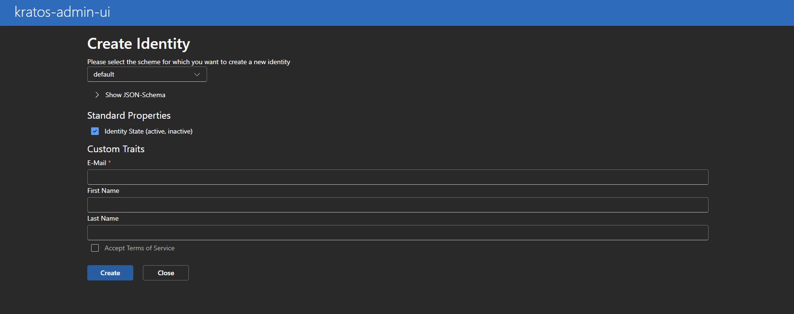
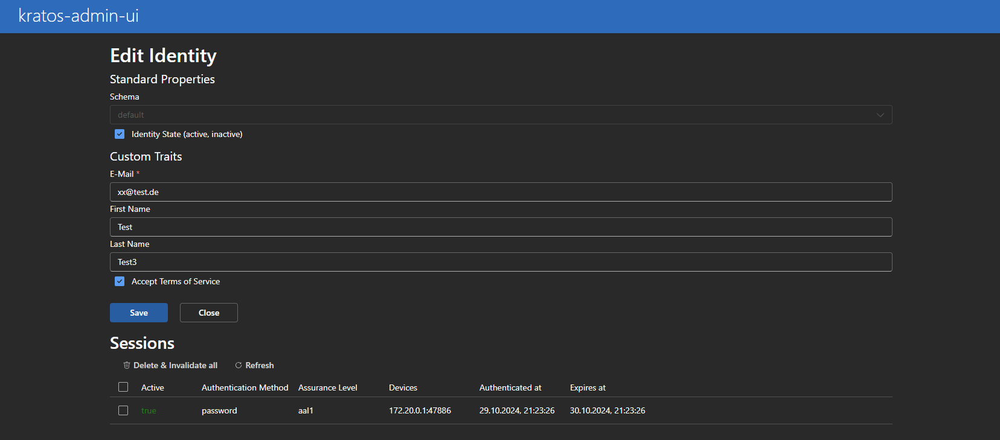

# kratos-admin-ui

A simple Admin-Interface for [ory/kratos](https://www.ory.sh/kratos/docs/). Made with React und [microsoft/fluentui](https://react.fluentui.dev/).

## Features

Following a overview over the features of kratos-admin-ui:

### List identites

You get a searchable and sortable overview of all identites:


### Single select identites

When you select one identity, the toolbar is getting expanded with actions like 
- View
- Edit
- Delete
- Recovery


### Multiselect identites

You can also do a delete and/or recovery action on multiple identites simultaneous


### View identity

If you want to see all attributes of a identity, you can open it in detail view.


### Create identites

To create a new identity you have to first select the identity schema which you configured in kratos. All identity traits getting rendered dynamically.



### Edit identity

You can edit all identity traits on the edit page.



## Run

To run the image, you have to provide two environment variables:

- `KRATOS_ADMIN_URL`: the admin url of your kratos instance
- `KRATOS_PUBLIC_URL`: the public url of your kratos instance

You should follow the kratos best practices, [which recommends to never expore the admin-api to the internet, since there is no authentication](https://www.ory.sh/docs/kratos/guides/production#admin-api).

To run the admin-ui, which of course needs access to the admin-api, you should run the admin-ui in the same network as kratos.

In the following snipped the admin-ui gets deployed in the same docker network (`kratos_intranet`) as kratos - over the Docker-Compose-DNS resolution the nginx reverse proxy can call the admin

```json
// config.json
{
  "kratosAdminURL": "http://localhost:4434",
  "kratosPublicURL": "http://localhost:4433",
  "reverseProxy": false
}
```

```shell
docker run -it \
--rm -p 5173:8080 \
-v $(pwd)/config.json:/public/config.json:ro \
-e KRATOS_ADMIN_URL=http://kratos:4434 \
-e KRATOS_PUBLIC_URL=http://kratos:4433 \
--network kratos_intranet \
ghcr.io/dfoxg/kratos-admin-ui
```

or like here, include it in a `docker-compose.yml` file:

```
services:
  kratos-migrate:
    image: oryd/kratos:v1.0.0
    environment:
      - DSN=sqlite:///var/lib/sqlite/db.sqlite?_fk=true&mode=rwc
    volumes:
      - type: volume
        source: kratos-sqlite
        target: /var/lib/sqlite
        read_only: false
      - type: bind
        source: ./contrib/quickstart/kratos/email-password
        target: /etc/config/kratos
    command: -c /etc/config/kratos/kratos.yml migrate sql -e --yes
    restart: on-failure
    networks:
      - intranet
  kratos:
    image: oryd/kratos:v1.0.0
    depends_on:
      - kratos-migrate
    ports:
      - '4433:4433' # public
    #  - '4434:4434' # admin, do not expose!
    restart: unless-stopped
    environment:
      - DSN=sqlite:///var/lib/sqlite/db.sqlite?_fk=true
      - LOG_LEVEL=trace
    command: serve -c /etc/config/kratos/kratos.yml --dev --watch-courier
    volumes:
      - type: volume
        source: kratos-sqlite
        target: /var/lib/sqlite
        read_only: false
      - type: bind
        source: ./contrib/quickstart/kratos/email-password
        target: /etc/config/kratos
    networks:
      - intranet
  admin_ui:
    image: ghcr.io/dfoxg/kratos-admin-ui:v2.5.0
    ports:
      - '80:8080'
    restart: unless-stopped
    environment:
      - KRATOS_ADMIN_URL=http://kratos:4434
      - KRATOS_PUBLIC_URL=http://kratos:4433
    networks:
      - intranet
networks:
  intranet:
volumes:
  kratos-sqlite:
```

### Optional Environment Variables

- `NAMESERVER`: the nameserver to use for dns resolution for kratos urls. By default, it reads values from /etc/resolv.conf, so it works well without setting this value in many runtimes. If there is no /etc/resolv.conf, it will be set to `127.0.0.11` (Docker dns).

## Start local

It is required, that a local instance of ory kratos is running. the latest tested version is `v1.1.0`.

```
cd kratos-admin-ui
npm install
node cors-proxy.js // starts a cors-proxy for the admin-api, so the browser can make requests
npm run start
```

## Build Docker-Image

```
cd kratos-admin-ui
docker build -t kratos-admin-ui .
```
