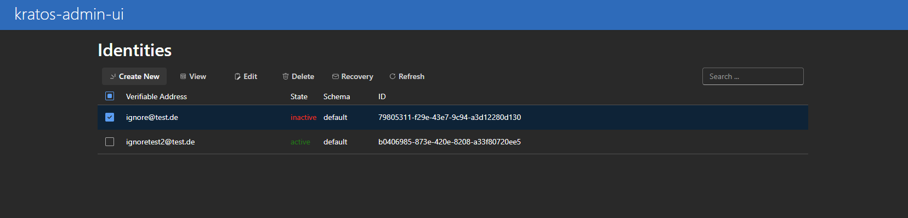

# kratos-admin-ui

A simple Admin-Interface for [ory/kratos](https://www.ory.sh/kratos/docs/). Made with React und Microsoft Fluent-UI.

## Start local

It is required, that a local instance of ory kratos is running. the latest tested version is `0.8.0-alpha.2`.

```
cd kratos-admin-ui
npm install
node cors-proxy.js // starts a cors-proxy for the admin-api, so the browser can make requests
npm run start
```

## Build Docker-Image

```
cd kratos-admin-ui
# edit the Dockerfile before and change the env-declarations to your kratos url
# ENV REACT_APP_KRATOS_ADMIN_URL <ADD-KRATOS-ADMIN-URL>
# ENV REACT_APP_KRATOS_PUBLIC_URL <ADD-KRATOS-PUBLIC-URL>
docker build -t kratos-admin-ui .
docker run -d -p80:80 kratos-admin-ui
```

## Images

Following a few sample images:

### List Identites


### Single Select Identity



### Multiselect Identities


### Create Identity


### Edit Identity


### View Identity


